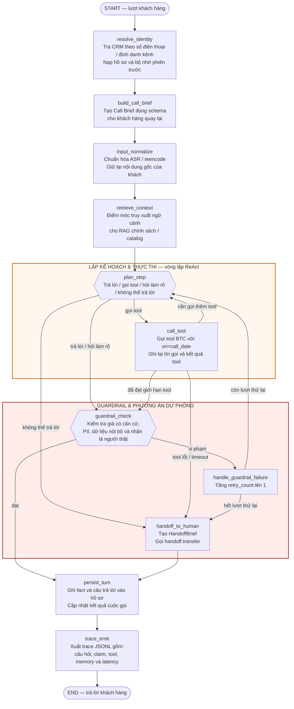

# Triển khai LangGraph

## 1. Tổng quan

Module này triển khai một agent telesales AI hội thoại xây dựng trên nền tảng **LangGraph**. Hệ thống quản lý các cuộc gọi tư vấn khách hàng bằng tiếng Việt với yêu cầu nghiêm ngặt về tính chính xác của dữ liệu, bộ nhớ dài hạn và các lớp guardrail an toàn.

### Vấn đề giải quyết

Hội thoại telesales đòi hỏi thông tin sản phẩm theo thời gian thực (giá, tồn kho, khuyến mãi), bộ nhớ xuyên suốt giữa các cuộc gọi (như diện tích phòng, ngân sách, rào cản tâm lý của khách), và tuyệt đối không được báo sai giá. Agent đảm nhiệm:

- **Ngăn chặn hallucination giá tiền**: Mọi mức giá hay khuyến mãi báo cho khách đều bắt buộc phải lấy từ kết quả thực thi tool truy vấn catalog trong lượt đó.
- **Bộ nhớ khách hàng xuyên cuộc gọi**: Nhận diện khách hàng quay lại qua hàm băm số điện thoại (bảo vệ PII) và tiếp nối ngữ cảnh đã tư vấn trước đó mà không hỏi lại các thông tin đã biết.
- **Xử lý sự cố & chuyển máy**: Tự động chuyển máy cho nhân viên chuyên trách khi gặp câu hỏi ngoài phạm vi, tool bị timeout hoặc guardrail vi phạm nhiều lần; đồng thời ghi nhận vào bảng `knowledge_gaps` để đội ngũ hoàn thiện tri thức.
- **Khả năng mở rộng tích hợp RAG**: Cung cấp sẵn một node độc lập (`retrieve_context`) sẵn sàng kết nối trực tiếp với pipeline RAG của nhóm trong Milestone 2.

### Các thành phần LangGraph sử dụng

- **`StateGraph`**: Quản lý quy trình và điều phối chuyển trạng thái giữa các node.
- **`CallState` (TypedDict)**: Schema lưu trạng thái cuộc gọi, sử dụng `operator.add` để tích lũy lịch sử hội thoại (`messages`) qua các lượt.
- **`MemorySaver`**: Quản lý checkpoint trong bộ nhớ cho các lượt thoại trong cùng một phiên gọi (`thread_id = call_id`).
- **Nodes**: Các đơn vị xử lý độc lập cho việc định danh CRM, tạo Call Brief, chuẩn hóa ASR/teencode, truy xuất ngữ cảnh, lập kế hoạch, gọi tool, kiểm tra guardrail, chuyển máy, lưu lượt và xuất trace.
- **Conditional Edges**: Điều hướng rẽ nhánh động dựa trên hành động của planner, kết quả tool, trạng thái guardrail và số lần retry.

---

## 2. Kiến trúc Graph



---

## 3. Cấu trúc thư mục

```text
langgraph_agent/
├── README.md                 # Tài liệu hướng dẫn
├── src/                      # Source code
│   ├── __init__.py           # Export các hàm và class public (build_graph, handle_customer_turn, ...)
│   ├── state.py              # Định nghĩa TypedDict CallState
│   ├── memory.py             # Quản lý SQLite database (profile slots, episodic summaries, CRM)
│   ├── tools.py              # Tool tìm kiếm catalog, tạo đơn hàng, tra cứu CRM & registry TOOLS
│   ├── prompts.py            # System prompt cho telesale & hàm format prompt
│   ├── llm.py                # Gọi Anthropic API & bộ stand-in chạy offline bằng rule
│   ├── guardrails.py         # Regex bóc tách số tiền & hàm kiểm tra đối soát với kết quả tool
│   ├── nodes.py              # Định nghĩa các node thực thi trong graph
│   ├── edges.py              # Các hàm điều hướng conditional edge
│   └── graph.py              # Khởi tạo StateGraph, biên dịch và các hàm public API
├── tests/
│   └── test_graph.py         # Bộ test suite đầy đủ (pytest)
└── examples/
    └── run_graph.py          # Script chạy thử nghiệm mẫu một kịch bản hội thoại
```

---

## 4. Cài đặt và Chạy thử

### Điều kiện tiên quyết (Prerequisites)

- Python 3.10 trở lên
- Cài đặt các thư viện cần thiết:
  ```bash
  pip install -r requirements.txt
  ```

### Cấu hình biến môi trường

Sao chép `.env.example` thành `.env` và điền các giá trị mong muốn:

```bash
cp .env.example .env
```

Các biến môi trường chính:

- `ANTHROPIC_API_KEY`: API key của Anthropic. Nếu để trống, hệ thống sẽ tự động chuyển sang chế độ stand-in offline phục vụ kiểm thử.
- `HARNESS_MODEL`: Model sử dụng (mặc định: `claude-sonnet-4-6`).
- `HARNESS_DB`: Đường dẫn file SQLite database (mặc định: `harness_memory.db`).

### Chạy kịch bản ví dụ

Để chạy thử kịch bản mô phỏng khách hàng mới và khách hàng quay lại:

```bash
python langgraph_agent/examples/run_graph.py
```

### Chạy kiểm thử tự động

Chạy bộ test suite với `pytest`:

```bash
pytest langgraph_agent/tests
```

Tất cả 7 kịch bản kiểm thử (khách hàng mới, khách hàng cũ tiếp nối thông tin, cập nhật hủy slot cũ khi khách đổi ý, guardrail chặn giá ảo và retry thành công, câu hỏi lạ chuyển máy & ghi nhận gap, timeout tool xử lý êm đẹp, regex nhận diện tiền) đều chạy offline mà không phụ thuộc vào API key bên ngoài.

---

## 5. Hướng dẫn tích hợp RAG (M2)

Node `retrieve_context` trong file [`src/nodes.py`](src/nodes.py) được thiết kế có chủ đích làm điểm móc nối (hook) cho RAG:

```python
def retrieve_context(state: CallState) -> CallState:
    # M1: Pass-through (cho phép dữ liệu đi qua mà không can thiệp)
    # M2: Tích hợp RAG retriever của nhóm tại đây, ví dụ:
    # docs = vector_retriever.invoke(state["messages"][-1]["content"])
    # return {"retrieved_kb": docs}
    return {"retrieved_kb": state.get("retrieved_kb", [])}
```

Khi tích hợp pipeline RAG từ vector database, nhóm chỉ cần thay thế hàm này bằng lệnh truy vấn retriever và đưa các đoạn văn bản (chunks) liên quan vào trường `retrieved_kb` của `CallState`.

## 6. Chạy trace theo contract BTC

Agent đọc dữ liệu từ `data/catalog/` và dùng đúng tên tool trong
`data/schemas/tools.schema.json`. Ngày gọi được truyền vào mọi tool có tham số
`on`; không dùng ngày hệ thống.

```bash
python langgraph_agent/run_eval.py --scenarios data/test_set/public_sample --config full --out full.jsonl
python data/eval/reference_eval.py --scenarios data/test_set/public_sample --trace full.jsonl
```

Thay `full` bằng `baseline_no_memory` để chạy cấu hình không dùng memory dài hạn.
Trace chứa `questions`, `claims`, `facts_used`, `memory_writes`, tool calls theo
tên BTC và latency fields.
