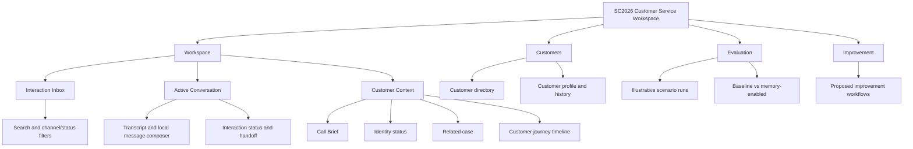

# SC2026 Mock UI — Information Architecture

```mermaid
flowchart TB
    APP[SC2026 Customer Service Workspace]
    APP --> WS[Workspace]
    APP --> CU[Customers]
    APP --> EV[Evaluation]
    APP --> IM[Improvement]
    WS --> INBOX[Interaction Inbox]
    WS --> CONV[Active Conversation]
    WS --> CTX[Customer Context]
    INBOX --> FILTER[Search and channel/status filters]
    CONV --> TRANSCRIPT[Transcript and local message composer]
    CONV --> STATUS[Interaction status and handoff]
    CTX --> BRIEF[Call Brief]
    CTX --> IDENTITY[Identity status]
    CTX --> CASE[Related case]
    CTX --> JOURNEY[Customer journey timeline]
    CU --> DIRECTORY[Customer directory]
    CU --> PROFILE[Customer profile and history]
    EV --> SCENARIOS[Illustrative scenario runs]
    EV --> COMPARE[Baseline vs memory-enabled]
    IM --> PROPOSALS[Proposed improvement workflows]
```
