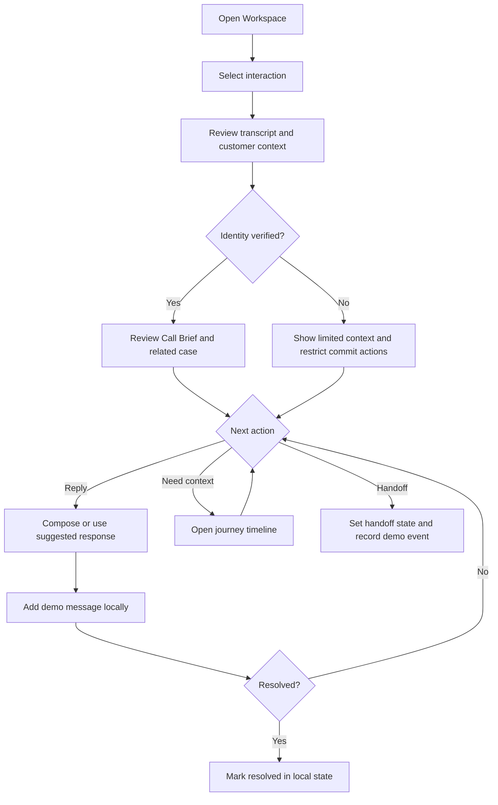
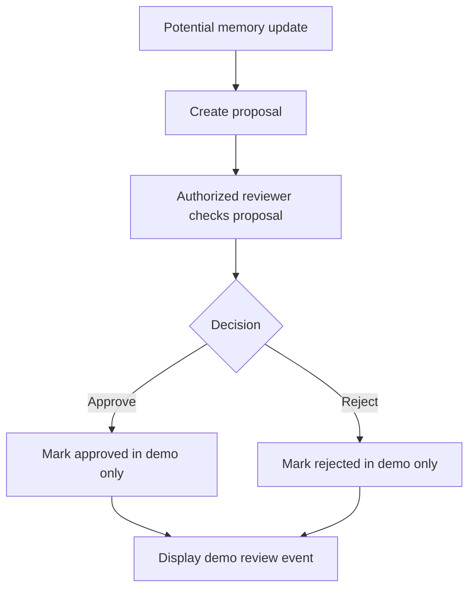

# SC2026 Mock UI — User Flows

## Handle an interaction

```mermaid
flowchart TD
    A[Open Workspace] --> B[Select interaction]
    B --> C[Review transcript and customer context]
    C --> D{Identity verified?}
    D -- Yes --> E[Review Call Brief and related case]
    D -- No --> F[Show limited context and restrict commit actions]
    E --> G{Next action}
    F --> G
    G -- Reply --> H[Compose or use suggested response]
    H --> I[Add demo message locally]
    I --> J{Resolved?}
    J -- No --> G
    J -- Yes --> K[Mark resolved in local state]
    G -- Need context --> L[Open journey timeline]
    L --> G
    G -- Handoff --> M[Set handoff state and record demo event]
```

## Memory proposal

```mermaid
flowchart TD
    A[Potential memory update] --> B[Create proposal]
    B --> C[Authorized reviewer checks proposal]
    C --> D{Decision}
    D -- Approve --> E[Mark approved in demo only]
    D -- Reject --> F[Mark rejected in demo only]
    E --> G[Display demo review event]
    F --> G
```

All flows are simulated in local UI state. They do not execute real agent or backend operations.
